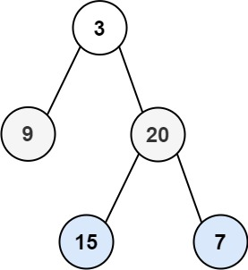

<!-- Problem Statement -->

Given the root of a binary tree, return the level order traversal of its nodes'
values. (i.e., from left to right, level by level).

***Example 1***



- **Input**:  root = [3, 9, 20, null, null, 15, 7]
- **Output**:  [[3], [9, 20], [15, 7]]

***Example 2***

- **Input**: root = [1]
- **Output**: [[1]]


## Approach 1: Iterative

This problem can be solved using the Breadth First Search (BFS) technique.

### Analysis

BFS traversal can be performed using a FIFO queue.

1. Push the `root` node to the queue.
2. Iterate until the queue is empty.
3. In each iteration, find the size of the queue: `curLevelSize`.
4. Pop `curLevelSize` number of nodes from the queue and push their values to an 
   array. This represents the traversal of the current level.
5. While removing each node from the queue, insert the node's children to the
   queue for further traversal.
6. If the queue is not empty, repeat from step 3 for the next level.

### Implementation

In C++:

```cpp
vector<vector<int>> levelOrder(TreeNode* root) {
    if (root == nullptr)
        return {};
    queue<TreeNode*> nodes;
    nodes.push(root);
    vector<vector<int>> traverse;
    while(!nodes.empty()) {
        int curLevelSize = nodes.size();
        vector<int> levelTraverse;
        while (curLevelSize--) {
            TreeNode* curNode = nodes.front();
            nodes.pop();
            levelTraverse.push_back(curNode -> val);
            if (curNode -> left) nodes.push(curNode -> left);
            if (curNode -> right) nodes.push(curNode -> right);
        }
        traverse.push_back(levelTraverse);
    }
    return traverse;
}
```

### Complexity Analysis

- **Time Complexity**: $O(N)$ where N is the number of nodes in the tree.
- **Space Complexity**: $O(N)$ extra, required for the queue.


## Approach 2: Recursive

### Analysis

This problem can also be solved in a recursive way (although the algorithm performs
worse than the first approach).

### Implementation

In C++:

```cpp
// returns the subtree rooted at `node`
int getHeight(TreeNode* node) {
    if (node == nullptr) return 0;
    return 1 + max(getHeight(node -> left), getHeight(node -> right));
}

void getCurrentLevel(TreeNode* node, int level, vector<int> &currentLevel) {
    if (node == nullptr) return;
    if (level == 1) currentLevel.push_back(node -> val);
    getCurrentLevel(node -> left, level - 1, currentLevel);
    getCurrentLevel(node -> right, level - 1, currentLevel);
}
    
vector<vector<int>> levelOrder(TreeNode* root) {
    int h = getHeight(root);
    vector<vector<int>> traversal(h);
    for (int i = 1; i <= h; i++) {
        vector<int> &currentLevel = traversal[i - 1];
        getCurrentLevel(root, i, currentLevel);
    }
    return traversal;
}
```

### Complexity Analysis

- **Time Complexity**: $O(N ^ 2)$ in the worst case (where N is the number of
  nodes in the tree). For a skewed tree, `getCurrentLevel` takes $O(N)$. Thus,
  time complexity is $O(N) + O(N - 1) + O(N - 2) + ... + O(1) = O(N ^ 2)$.
- **Space Complexity**: $O(N)$ extra, required for the implicit stack used in 
  recursion (for a skewed tree). For a balanced tree, the call stack uses $O(height)
  = O(N log N)$ space.
