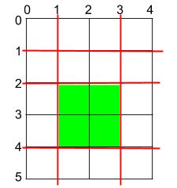
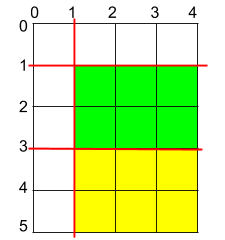

<!-- Problem Statement -->

Given a rectangular cake with height h and width w, and two arrays of integers
`horizontalCuts` and `verticalCuts` where `horizontalCuts[i]` is the distance
from the top of the rectangular cake to the i-th horizontal cut and similarly,
`verticalCuts[j]` is the distance from the left of the rectangular cake to the
j-th vertical cut.

Return the maximum area of a piece of cake after you cut at each horizontal and
vertical position provided in the arrays `horizontalCuts` and `verticalCuts`.
Since the answer can be a huge number, return this modulo $10^9 + 7$.

**_Example 1_**

- **Input**:  h = 5, w = 4, horizontalCuts = [1, 2, 4], verticalCuts = [1, 3]  
- **Output**:  4  
- **Explanation**: The figure represents the given rectangular cake. Red lines
  are the horizontal and vertical cuts. After you cut the cake, the green piece
  of cake has the maximum area.



***Example 2***

- **Input**: h = 5, w = 4, horizontalCuts = [3,1], verticalCuts = [1]
- **Output**: 6
- **Explanation**: The figure represents the given rectangular cake. Red lines
  are the horizontal and vertical cuts. After you cut the cake, the green and
  yellow pieces of cake have the maximum area.



***Example 3***

- **Input**: h = 5, w = 4, horizontalCuts = [3], verticalCuts = [3]
- **Output**: 9

## Approach: Sorting

### Analysis

As seen in the figure above each horizontal cut cuts all the vertical cuts and
form rectangles. Thus, the maximum area (cross-section) of the rectangle would
be formed by maximum gap between horizontal cuts and vertical cuts.

To find the consecutive gaps, we need to first sort `horizontalCuts` and `verticalCuts`. In the following implementation, `getMaxGap`
is used to find the maximum gap between the cuts (horizontal and vertical).

- First,
we sort the `cuts` array and then assign `maxGap` to `cuts[0]` (difference between start
and first cut).
- We then iterate through the array and find the maximum gap between
subsequent cuts.
- Finally, we calculate the gap between last cut and end, and if it is greater
  than `maxGap`, we assign `maxGap` to this value.

`getMaxGap` is called for both `horizontalCuts` and `verticalCuts`, and we find
the maximum area by multiplying the returned results.

### Implementation

In C++:

```cpp
int getMaxGap(vector<int> &cuts, int length) {
    sort(cuts.begin(), cuts.end());
    // gap bwtween start (0) and first cut
    int maxGap = cuts[0];
    for (int i = 1; i < (int)cuts.size(); ++i) {
        // gap between subsequent cuts
        maxGap = max(maxGap, cuts[i] - cuts[i - 1]);
    }
    // gap between last cut and end
    maxGap = max(maxGap, length - cuts.back());
    return maxGap;
}
int maxArea(int h, int w, vector<int>& horizontalCuts, vector<int>& verticalCuts) {
    const int mod = 1'000'000'007;
    const int x = getMaxGap(horizontalCuts, h);
    const int y = getMaxGap(verticalCuts, w);
    return (int)((long) x % mod * (long) y % mod) % mod;
}
```

In Python:

```python
def getMaxGap(cuts, length):
    cuts.sort()
    # gap between start (0) and first cut
    maxGap = cuts[0]
    for i in range(1, len(cuts)):
        # gap between subsequent cuts
        maxGap = max(maxGap, cuts[i] - cuts[i - 1])
    # gap between last cut and end
    maxGap = max(maxGap, length - cuts[-1])
    return maxGap


def maxArea(h, w, horizontalCuts, verticalCuts):
    mod = 10**9 + 7
    x = getMaxGap(horizontalCuts, h)
    y = getMaxGap(verticalCuts, w)
    return (x % mod * y % mod) % mod
```

### Complexity Analysis

- **Time Complexity**: $O(NlogN + MlogM)$ required for sorting
  (where $N =$ len(horizontalCuts), $M =$ len(verticalCuts))
- **Space Complexity**: $O(1)$, constant space required
