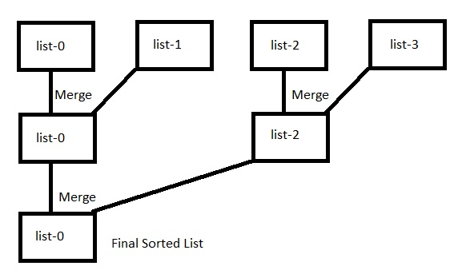

<!-- Problem Statement -->

Given the head of $k$ sorted linked lists, merge those lists to form a final sorted
linked list.

_Example 1_

**Input**: [[1, 3, 6], [2, 4, 5]]  
**Output**:  [1, 2, 3, 4, 5, 6]

## Solution 1: Comparing Nodes One by One

### Algorithm

- Compare the nodes pointed by `lists[i]` (the smallest node of the current
  linked list) and find the smallest value of the node among all linked list.
- Add that node to final sorted linked list.
- Repeat this as long as all the nodes are not covered.

### Implementation

```cpp
ListNode* mergeKLists(vector<ListNode*>& lists) {
    // dummy node to save the location of `head` node of
    // the final linked list
    ListNode *head = new ListNode(0);
    // `cur` is used to populate the final sorted linked list
    ListNode* cur = head;
    while (true) {
        bool isEnd = true;
        // find the minimum among the nodes which are
        // pointed by `lists_i`
        int minimum = INT_MAX;
        int minIdx = 0;
        for (int i = 0; i < (int)lists.size(); ++i) {
            if (lists[i]) {
                if (lists[i] -> val < minimum) {
                    minimum = lists[i] -> val;
                    minIdx = i;
                }
                isEnd = false;
            }
        }
        if (isEnd) break;
        // consume lists[minIdx]
        cur -> next = lists[minIdx];
        cur = cur -> next;
        // advance the node pointed by lists[minIdx]
        lists[minIdx] = lists[minIdx] -> next;
    }
    // last node
    cur -> next = nullptr;
    return head -> next;
}
```

### Complexity Analysis

- **Time Complexity**: $O(kN)$ (where $k$ = number of linked lists, $N$ = total
  number nodes), the `for` loop runs for $k$ times for every node in all the
  linked lists.
- **Space Complexity**: $O(1)$, constant space is used.

## Solution 2: Priority Queue

### Algorithm

- Instead of comparing the nodes one by one, we can make use of a data structure
  which can give us the smallest node efficiently. One such data structure is
  priority queue.
- The priority queue store the first node in consideration for all the linked
  lists and in each step, we can find the smallest node in $O(logk)$ time
  complexity.
- Once we find the smallest node, we can include this to final linked list and
  the linked list containing the smallest node is advanced by one step. 

Note that we have used a custom comparator here. More information may be found
[in this post](/posts/top-k-frequent-words#using-custom-comparator-in-priority-queue-in-c---a-primer).

### Implementation

```cpp
ListNode* mergeKLists(vector<ListNode*>& lists) {
    // dummy node to save the location of `head` node of
    // the final linked list
    ListNode *head = new ListNode(0);
    // `cur` is used to populate the final sorted linked list
    ListNode* cur = head;
    // custom comparator for priority queue
    auto comp = [](const ListNode* u, const ListNode* v) {
        return u -> val > v -> val;
    };
    priority_queue< ListNode*, vector<ListNode*>, decltype(comp) > q(comp);
    for (auto node: lists) {
        if (node) {
            q.push(node);
        }
    }
    while (!q.empty()) {
        ListNode* least = q.top();
        q.pop();
        // consume least
        cur -> next = least;
        // advance cur
        cur = cur -> next;
        least = least -> next;
        if (least) {
            q.push(least);
        }
    }
    // last node
    cur -> next = nullptr;
    return head -> next;
}
```

### Complexity Analysis

- **Time Complexity**: $O(Nlogk)$, (where $k$ = number of linked lists,
  $N$ = total number nodes) since size of the priority queue never exceeds $k$,
  inserting and removing the smallest node takes $O(logk)$.
- **Space Complexity**: $O(k)$, the size of priority queue never exceeds $k$.

## Solution 3: Divide and Conquer (Recursive)

### Algorithm

The intuition for this algorithm is the merge sort algorithm. Since the individual 
linked lists are sorted, we can call the `mergeKListImpl` function until there
is only one linked list. In this way, we can merge the linked lists in a top-down
fashion to produce a final sorted linked list.

### Implementation

```cpp
/**
This method merges two sorted linked list pointed by their head `list1` and
`list2` and outpus a sorted linked list

Time complexity: O(length of list1 + length of list2)
Space complexity: O(1)
*/
ListNode* mergeTwoLists(ListNode* list1, ListNode* list2) {
    // dummy node to save the location of `head` node of
    // the final linked list
    ListNode* head = new ListNode(0);
    // `cur` is used to populate the final sorted linked list
    ListNode* cur = head;
    while (list1 and list2) {
        if (list1 -> val < list2 -> val) {
            cur -> next = list1;
            list1 = list1 -> next;
        } else {
            cur -> next = list2;
            list2 = list2 -> next;
        }
        cur = cur -> next;
    }
    if (list1 == nullptr) cur -> next = list2;
    else cur -> next = list1;
    return head -> next;
}
    
ListNode* mergeKListsImpl(vector<ListNode*>& lists, int low, int high) {
    if (low > high) return nullptr;
    if (low == high) return lists[low];
    
    int mid = low + (high - low) / 2;
    ListNode* left = mergeKListsImpl(lists, low, mid);
    ListNode* right = mergeKListsImpl(lists, mid + 1, high);
    return mergeTwoLists(left, right);
}

ListNode* mergeKLists(vector<ListNode*>& lists) {
    int size = lists.size();
    return mergeKListsImpl(lists, 0, size - 1);
}
```

### Complexity Analysis

- **Time Complexity**: $O(Nlogk)$, (where $k$ = number of linked lists, $N$ = total number nodes)
- **Space Complexity**: $O(log_2k)$, for the required stack space in recursion.

## Solution 4: Divide and Conquer (Iterative)

### Algorithm

We can implement the above algorithm iteratively. In this way, we don't need the
extra stack space.

- First merge every consecutive pair (i-th and (i + 1)-th) and assign the merge
  linked list's head to the i-th linked list's head.
- Then, merge i-th and (i + 2)-th linked lists and assign the head to i-th linked
  list.
- Continue this as long as not all the linked lists (and the derived ones as well)
  are not merged.



### Implementation

```cpp
/**
This method merges two sorted linked list pointed by their head `list1` and
`list2` and outpus a sorted linked list

Time complexity: O(length of list1 + length of list2)
Space complexity: O(1)
*/
ListNode* mergeTwoLists(ListNode* list1, ListNode* list2) {
    // dummy node to save the location of `head` node of
    // the final linked list
    ListNode* head = new ListNode(0);
    // `cur` is used to populate the final sorted linked list
    ListNode* cur = head;
    while (list1 and list2) {
        if (list1 -> val < list2 -> val) {
            cur -> next = list1;
            list1 = list1 -> next;
        } else {
            cur -> next = list2;
            list2 = list2 -> next;
        }
        cur = cur -> next;
    }
    if (list1 == nullptr) cur -> next = list2;
    else cur -> next = list1;
    return head -> next;
}

ListNode* mergeKLists(vector<ListNode*>& lists) {
    int size = lists.size();
    if (size == 0) return nullptr;
    int interval = 1;
    while (interval < size) {
        for (int i = 0; i + interval < size; i += interval * 2) {
            lists[i] = mergeTwoLists(lists[i], lists[i + interval]);
        }
        interval *= 2;
    }
    return lists[0];
}
```

### Complexity Analysis

- **Time Complexity**: $O(Nlogk)$ (where $k$ = number of linked lists, $N$ = total number nodes).
- **Space Complexity**: $O(1)$, constant space is used.
