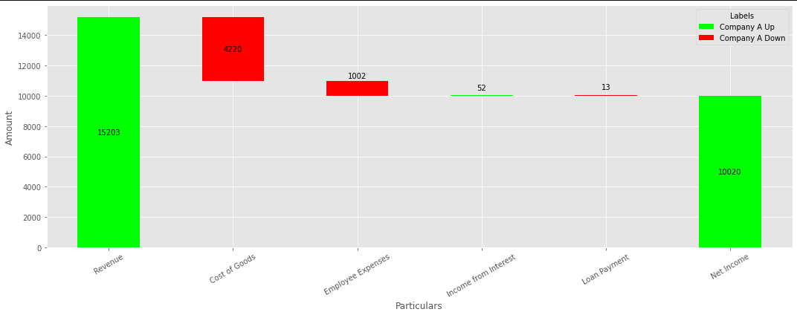
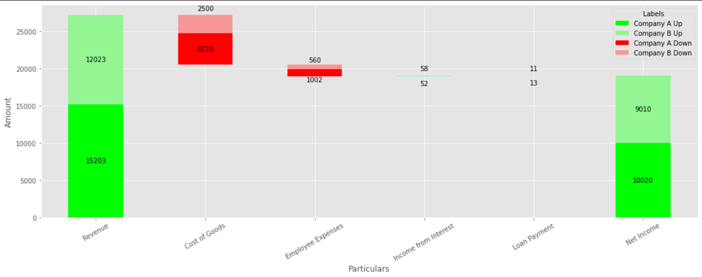

## What is Waterfall Chart?

Wikipedia says "a waterfall chart is a form of data visualization that helps in
understanding the cumulative effect of sequentially introduced positive or
negative values". It shows a running total as values are added or subtracted.

## Creating Simple Waterfall Chart in Matplotlib

Consider the following table:

|Particulars         |Company A|
|--------------------|---------|
|Revenue             |15203    |
|Cost of Goods       |-4220    |
|Employee Expenses   |-1002    |
|Income from Interest|52       |
|Loan Payment        |-13      |
|Net Income          |10020    |

For simplicity, we only have 1 column in this table.

The waterfall chart for this table would be:


### Code

First, let's import the necessary dependencies:

```python
import pandas as pd
import matplotlib.pyplot as plt

plt.style.use('ggplot')
```

Then, read the CSV file:

```python
df = pd.read_csv('./Waterfall-Chart-Data-Single.csv')
```

The CSV file used in this code can be found [here](./Waterfall-Chart-Data-Single.csv).

Now, in order to render the waterfall chart we will be using matplotlib's stacked
bar chart. We will have an invisible base bar. The function `get_data` will be used
to calculate the values for the stacked bar chart.

The data (used for rendering the stacked bar chart) for the above table would be:

```json
{'_Base': [0, 10983, 9981, 9981, 10020, 0],
 'Company A Up': [15203, 0, 0, 52, 0, 10020],
 'Company A Down': [0, -4220, -1002, 0, -13, 0]}
```

```python
def get_data(df):
    row_count = len(df.index)
    # Underscore is pre-pended to Base to ensure that it doesn't show up in the
    # lengend box
    data = {
        '_Base': [] * row_count,
    }
    # Since we have only 1 column, we are extracting the 2nd element
    column = df.columns[1]
    for change in ['Up', 'Down']:
        data[column + ' ' + change] = [] * row_count

    for key in data:
        data[key] = [0] * row_count
    
    for idx, value in enumerate(df[column]):
        if value >= 0:
            data[column + ' Up'][idx] = df.loc[idx, column]
        else:
            data[column + ' Down'][idx] = df.loc[idx, column]

    # calculate base
    prev = df.loc[0, column]
    # Base for last will always be 0
    for i in range(row_count - 1):
        delta = 0
        cur = df.loc[i, column]
        if prev <= 0 and cur < 0:
            delta = cur
        elif prev < 0:
            delta = 0
        elif prev > 0 and cur < 0:
            delta = cur + prev
        else:
            delta = prev
        # ignore the calculation for first as it will always be 0
        data['_Base'][i] = 0 if i == 0 else data['_Base'][i - 1] + delta
        prev = cur
    return data
```

Finally, we will render the stacked bar chart:

```python
def render_chart(data, df):
    # get the first column
    particular_names = df.iloc[:,0]
    X_AXIS = [particular for particular in particular_names]

    index = pd.Index(X_AXIS, name='Particulars')
    colors = ['#ffffff00', '#00ff00', '#ff0000']
    df_for_plotting = pd.DataFrame(data, index=index).abs()
    ax = df_for_plotting.plot(
        kind='bar',
        stacked=True,
        figsize=(15, 6),
        color=colors
    )
    ax.set_ylabel('Amount')

    row_count = len(X_AXIS)
    # ignore the base texts
    for p in ax.patches[row_count:]:
        width, height = p.get_width(), p.get_height()
        x, y = p.get_xy()
        if height:
            ax.text(
                x + width / 2, 
                y + height / 2, 
                int(height),
                horizontalalignment='center', 
                verticalalignment='center',
                color='black',
            )

    plt.xticks(rotation=30)
    plt.legend(title='Labels', bbox_to_anchor=(1.0, 1), loc='best')
    plt.tight_layout()
    plt.show()
```


If we observe the image, we can see that the labels are overlapping with the bars
if the height of the bars are less. Let's fix this by positioning the labels above
the bars if their height is less than some threshold.

```python
def render_chart(data, df):
    # get the first column
    particular_names = df.iloc[:,0]
    X_AXIS = [particular for particular in particular_names]

    index = pd.Index(X_AXIS, name='Particulars')
    colors = ['#ffffff00', '#00ff00', '#ff0000']
    df_for_plotting = pd.DataFrame(data, index=index).abs()
    ax = df_for_plotting.plot(
        kind='bar',
        stacked=True,
        figsize=(15, 6),
        color=colors
    )
    ax.set_ylabel('Amount')

    row_count = len(X_AXIS)
    y_min, y_max = ax.get_ylim()
    max_height = y_max - y_min
    height_limit = max_height * 0.1
    # ignore the base texts
    for p in ax.patches[row_count:]:
        width, height = p.get_width(), p.get_height()
        x, y = p.get_xy()
        if height:
            height_offset = 0
            if height < height_limit:
                height_offset = max(max_height / 30, height * 5 / 6)
            ax.text(
                x + width / 2, 
                y + height / 2 + height_offset, 
                int(height),
                horizontalalignment='center', 
                verticalalignment='center',
                color='black',
            )

    plt.xticks(rotation=30)
    plt.legend(title='Labels', bbox_to_anchor=(1.0, 1), loc='best')
    plt.tight_layout()
    plt.show()
```



Full code for this illustration can be found [here](#).

If you need simple waterfall chart, you don't need to follow this method since
there are libraries which already do that ([Plotly](https://plotly.com/python/waterfall-charts/),
[waterfall_ax](https://github.com/microsoft/waterfall_ax)).


## Creating Stacked Waterfall Chart in Matplotlib

Consider the following data:

|Particulars         |Company A|Company B|
|--------------------|---------|---------|
|Revenue             |15203    |12023    |
|Cost of Goods       |-4220    |-2500    |
|Employee Expenses   |-1002    |-560     |
|Income from Interest|52       |58       |
|Loan Payment        |-13      |-11      |
|Net Income          |10020    |9010     |


The stacked waterfall chart looks like:



### Code

Let's start by importing the required libraries:

```python
import pandas as pd
import matplotlib.pyplot as plt

plt.style.use('ggplot')
```

Then, read the CSV file:

```python
df = pd.read_csv('./Waterfall-Chart-Data.csv')
```

Like the previous illustration, we will be using matplotlib's stacked bar chart.
For the above table `data` (used for rendering the stacked bar chart) would be:

```json
{'_Base': [0, 20506, 18944, 18944, 19030, 0],
 'Company A Up': [15203, 0, 0, 52, 0, 10020],
 'Company B Up': [12023, 0, 0, 58, 0, 9010],
 'Company A Down': [0, -4220, -1002, 0, -13, 0],
 'Company B Down': [0, -2500, -560, 0, -11, 0]}
```

The function `get_data` returns this data dictionary.

```python
def get_data(df):
    row_count = len(df.index)
    # Underscore is pre-pended to Base to ensure that it doesn't show up in the
    # lengend box
    data = {
        '_Base': [0] * row_count,
    }

    columns = df.columns[1: ]
    for change in ['Up', 'Down']:
        for column in columns:
            data[column + ' ' + change] = [0] * row_count
    
    for column in columns:
        for idx, value in enumerate(df[column]):
            if value >= 0:
                data[column + ' Up'][idx] = df.loc[idx, column]
            else:
                data[column + ' Down'][idx] = df.loc[idx, column]

    # calculate base
    prev = 0
    # Base for last will always be 0
    for i in range(row_count - 1):
        delta = 0
        cur = df.loc[i, columns].sum()
        if prev <= 0 and cur < 0:
            delta = cur
        elif prev < 0:
            delta = 0
        elif prev > 0 and cur < 0:
            delta = cur + prev
        else:
            delta = prev
        # ignore the calculation for first as it will always be 0
        data['_Base'][i] = 0 if i == 0 else data['_Base'][i - 1] + delta
        prev = cur
    return data
```

Finally, we will use the `render_chart` function to render the stacked bar chart.

```python
def render_chart(data, df):
    # get the first column
    particular_names = df.iloc[:,0]
    X_AXIS = [particular for particular in particular_names]

    index = pd.Index(X_AXIS, name='Particulars')
    colors = ['#ffffff00', '#00ff00', '#93f693', '#ff0000', '#f79696']
    df_for_plotting = pd.DataFrame(data, index=index).abs()
    ax = df_for_plotting.plot(
        kind='bar',
        stacked=True,
        figsize=(15, 6),
        color=colors
    )
    ax.set_ylabel('Amount')

    row_count = len(X_AXIS)
    # ignore the base texts
    for p in ax.patches[row_count:]:
        width, height = p.get_width(), p.get_height()
        x, y = p.get_xy()
        if height:
            ax.text(
                x + width / 2, 
                y + height / 2, 
                int(height),
                horizontalalignment='center', 
                verticalalignment='center',
                color='black',
            )

    plt.xticks(rotation=30)
    plt.legend(title='Labels', bbox_to_anchor=(1.0, 1), loc='best')
    plt.tight_layout()
    plt.show()
```

The rendered chart will look like this:


As we can observe, for smaller values the bar chart and the labels are overlapping
(see _Income from Interest_ and _Loan Payment_). Let's fix this by positioning the
labels above and below the bars for smaller values.

```python
def render_chart(data, df):
    # get the first column
    particular_names = df.iloc[:,0]
    X_AXIS = [particular for particular in particular_names]

    index = pd.Index(X_AXIS, name='Particulars')
    colors = ['#ffffff00', '#00ff00', '#ff0000']
    df_for_plotting = pd.DataFrame(data, index=index).abs()
    ax = df_for_plotting.plot(
        kind='bar',
        stacked=True,
        figsize=(15, 6),
        color=colors
    )
    ax.set_ylabel('Amount')

    row_count = len(X_AXIS)
    y_min, y_max = ax.get_ylim()
    max_height = y_max - y_min
    height_limit = max_height * 0.1
    # ignore the base texts
    for p in ax.patches[row_count:]:
        width, height = p.get_width(), p.get_height()
        x, y = p.get_xy()
        if height:
            height_offset = 0
            if height < height_limit:
                height_offset = max(max_height / 30, height * 5 / 6)
            ax.text(
                x + width / 2, 
                y + height / 2 + height_offset, 
                int(height),
                horizontalalignment='center', 
                verticalalignment='center',
                color='black',
            )

    plt.xticks(rotation=30)
    plt.legend(title='Labels', bbox_to_anchor=(1.0, 1), loc='best')
    plt.tight_layout()
    plt.show()
```


Full code can for this illustration can be found [here](#).

## Usage in Power BI

Power BI doesn't offer a built-in chart for stacked waterfall chart. This method
can be used in Power BI for rendering stacked waterfall chart using its ability
to render [Python visuals](https://docs.microsoft.com/en-us/power-bi/connect-data/desktop-python-visuals). 
